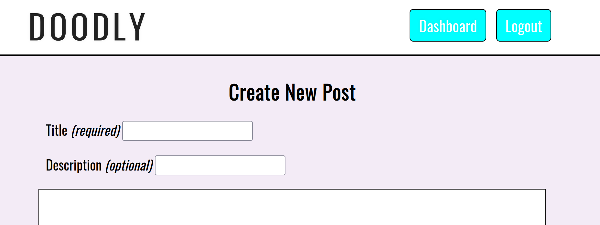
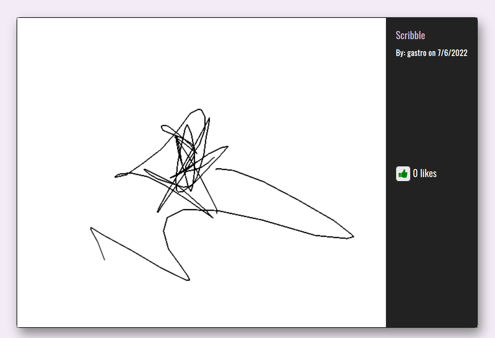

# Doodly

## Description
A social media site for impromptu artworks! Draw from scratch on our embedded canvas or upload a picture of your own to modify. 





## Technologies
This is a Node.js-based app that uses Express.js, the Handlebars templating engine, a MySQL database, and Sequelize ORM. The live app is deployed on [Heroku](https://doodly-site.herokuapp.com/).

## Installation
After downloading, run 
```
npm i
```
to install dependencies.
## Usage
### Local Host
Start a local server with the command:
```
node server
```
OR 
```
npm start
```
After the default MySQL queries are made, look for this message to indicate a successful connection:
```
Now listening
```
## Heroku app
The live app can be visited here: [Doodly](https://doodly-site.herokuapp.com/).
